<div align="center">



<a href="https://github.com/NelloGamerz">
  
</a>

<br/>

<a href="https://personal-portfolio-seven-dusky.vercel.app/"></a>
<a href="https://www.linkedin.com/in/karan-pareek-337067270"></a>
<a href="https://leetcode.com/u/NelloG/"></a>
<a href="https://www.instagram.com/kpareek_03/"></a>
<a href="mailto:karanpareek1112@gmail.com"></a>

<br/><br/>


</div>

## 🧠 Model Card

<table>
<tr>
<td width="220" align="center">
  
</td>
<td>

```python
class KaranPareek(Engineer):
    education = "Computer Science Engineering @ GGSIPU"
    focus     = ["AI-driven UI/UX", "Custom tools", "Modern app development"]
    range     = "Full stack: pixel-perfect frontends to secure backend APIs"
    practice  = "Consistent problem solver on LeetCode"
    mindset   = "Always curious. Always building."
```

</td>
</tr>
</table>

<div align="center"></div>

## 🖥️ Featured Work

- 🖥️ **Portfolio:** [Karan Pareek](https://personal-portfolio-seven-dusky.vercel.app/)
- 🧠 **LeetCode:** [NelloG](https://leetcode.com/u/NelloG/)
- 🤖 **AI tools:** [V0.dev](https://v0.dev) · [Bolt](https://boltai.com) · [OpenAI](https://openai.com)

<div align="center"></div>

## 🧰 Network Architecture

<div align="center">

**Input layer · Languages**


**Hidden layer 1 · Frontend**


**Hidden layer 2 · Backend & APIs**


**Hidden layer 3 · Data**


**Hidden layer 4 · Cloud & infrastructure**


**Output layer · Tools & integrations**


<br/><br/>


</div>

## ⚡ AI Tools in Use

| Tool | Role |
| --- | --- |
| **[V0.dev](https://v0.dev)** | Instant UI generation |
| **[Bolt](https://boltai.com)** | Design & code assistant |
| **[OpenAI](https://openai.com)** | Smart GPT integrations |

<div align="center"></div>

## 📊 Training Metrics

<div align="center">


</div>

## 🌐 Let's Connect

- 🔗 [LinkedIn](https://www.linkedin.com/in/karan-pareek-337067270)
- 🧠 [LeetCode](https://leetcode.com/u/NelloG/)
- 🌐 [Instagram](https://www.instagram.com/kpareek_03/)
- 📧 karanpareek1112@gmail.com

<br/>

